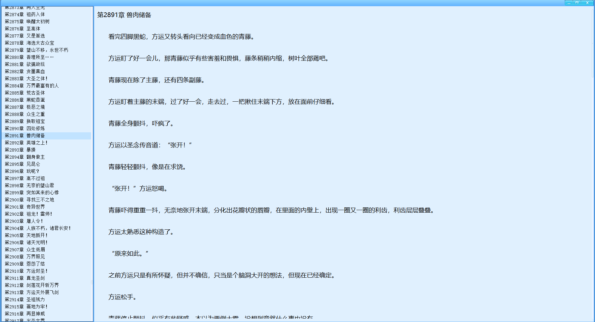

# novel-win
windows平台下支持小说搜索、下载、阅读win32应用

## 运行效果

### 搜索页面

### 下载页面

### 书架页面

### 阅读页面

## 安装

[安装文件](./distrib/novel-win-0.0.2.zip "安装文件")

## 注意

1. 本项目GUI使用DuiLib库，所以需要正确设置好DuiLib的头文件路径，库文件路径，并且保证对应的dll文件在PATH路径下
2. 编译本项目的时候，需要VS2017之上的版本
3. 运行的时候，因为设置DUILIB文件的路径是最后可执行文件所在的路径，但是当前没有将Debug或者Release上传到Github上，所以需要自己拷贝deps下的文件到对应的Debug和Release路径下才能保证程序运行
4. deps路径下backend.exe和search.exe源码位于[linux PC端小说阅读](https://github.com/TwoFlyLiu/novel)项目中的backend目录和search2目录, 这两个应用是使用golang进行编写的,所以根据需要自己来安装相应的环境来进行编译

## 感谢

+ 感谢[duilib](https://github.com/duilib/duilib)项目

## 参考

+ [linux PC端小说阅读](https://github.com/TwoFlyLiu/novel)项目
